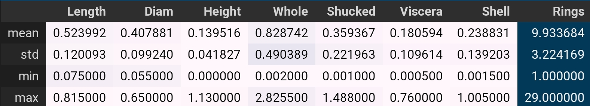
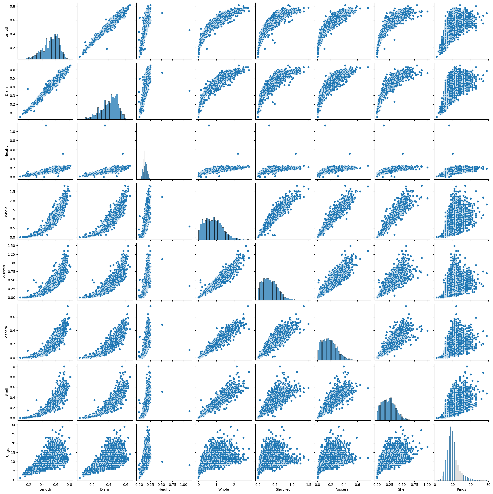
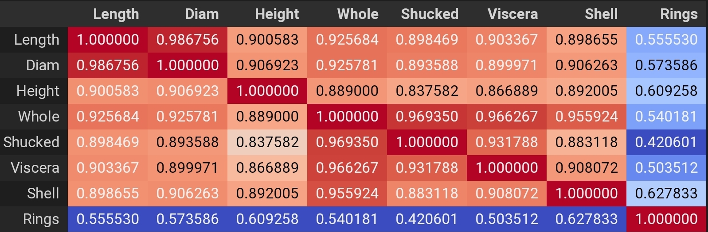
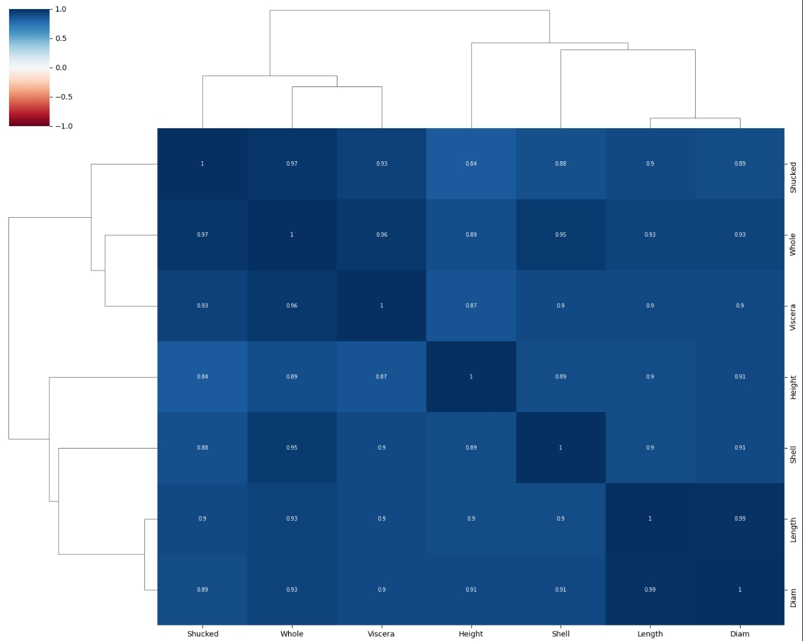
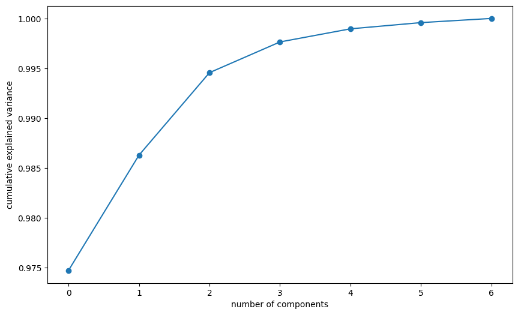
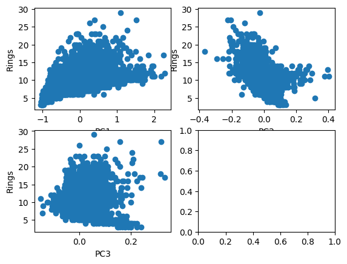
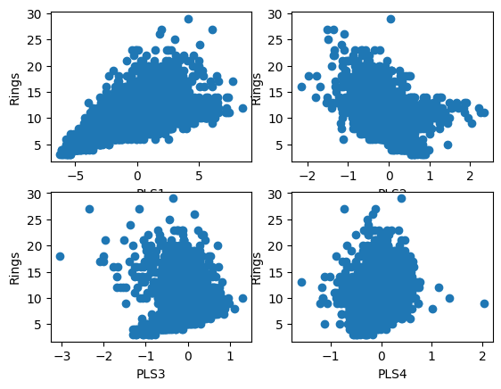

<h1 style="text-align: center;">Linear vs PCR vs PLS models</h1>

Modelado Predictivo

Gregorio Alvarez

### Introducción:

Este informe tiene como objetivo comparar y analizar las diferencias entre las predicciones realizadas por diferentes modelos en un estudio de regresión. En particular, se examinarán las predicciones generadas por un modelo lineal estándar, un modelo lineal después de la selección de variables, un modelo lineal después de aplicar PCA a las variables de entrada y un modelo PLS (Partial Least Squares). El objetivo es determinar cuál de estos enfoques ofrece las predicciones más precisas y confiables al ser utilizados en la base de datos [abalone].

### Descripción de la base de datos

La base de datos Abalone contiene informacion de los abalones, un tipo de molusco. En este caso se busca predecir la edad del abalon dado el resto de variables.
La base de datos contiene 4177 instancias y 9 atributos.
Ya que en este estudio no se realizaran transformaciones de variables categoricas, estas no seran tomadas en cuenta en los modelos.

A continuación se muestra una descripción de cada columna por fila:

Variables independientes:

1. Length: Continuo, longitud más larga medida en mm.
2. Diam: Continuo, diámetro perpendicular a la longitud en mm.
3. Height: Continuo, altura con respecto al cono en mm.
4. Whole: Continuo, peso entero del abalón en gramos.
5. Shucked: Continuo, peso del abalón sin la concha en gramos.
6. Visceras: Continuo, peso de las vísceras en gramos.
7. Shell: Continuo, peso del caparazón en gramos.

Variable dependiente:

1. Rings: Entero, edad del abalón en años.

### Metodología

#### Preprocesamiento:

Se realizó un análisis exploratorio de los datos para entender su estructura y características. Esto incluyó la identificación de variables y la comprobación de la existencia de valores atípicos.

Se creó una gráfica de pares para visualizar la relación entre la variable dependiente e independiente.
Se encontraron valores atípicos en la variable de altura

Se decidió remover los valores atípicos en base a su z-score. Se eliminaron los datos con z-score mayor a 3 o menor a -3.

#### Regresión Lineal:

Se procedió a separar los datos en conjuntos de entrenamiento y prueba. Se utilizó una proporción de 70% para entrenamiento y 30% para prueba.

Utilizando los datos de entrenamiento, se creó un modelo lineal. 

Se evaluó el modelo utilizando los datos de prueba y entrenamiento. Como métricas se utilizó el error cuadrático medio (RMSE) y el coeficiente de determinación (R²).

Se obtuvieron los siguientes resultados:

|  set  | RMSE   | R²     |
|-------|--------|--------|
| Test  | 2.1167 | 0.5684 |
| Train | 2.2211 | 0.5244 |

#### R.L. con Selección de variables

se llevó a cabo una selección de variables basada en su correlación. Para ello, se realizó un análisis de correlación utilizando una tabla de correlación, donde se determinó que la correlación entre la variable dependiente y las variables independientes era baja.

Sin embargo, para obtener una visión más completa de las relaciones entre las variables, se utilizó un enfoque gráfico basado en la técnica de clusterización. Mediante este análisis, se pudo observar que todas las variables presentaban una correlación significativa entre sí. Además, se identificaron tres grupos de variables que mostraban la mayor correlación dentro de cada grupo.

Finalmente, se seleccionaron las variables en base a un criterio de correlación global y correlación promedio entre pares, con lo que se obtuvieron las variables Length, Height, Shucked, Shell.

Se creó un modelo lineal y se evaluaron los resultado de las predicciones, los cuales se muestran a continuación.

|  set  | RMSE   | R²     |
|-------|--------|--------|
| Test  | 2.1809 | 0.5418 |
| Train | 2.2638 | 0.5059 |

#### PCR

Se aplico PCA a las variables de entrada. Una vez aplicado el PCA, se obtuvo un gráfico de varianza acumulada. Basandose en el criterio del codo, se optó por seleccionar las primeras 3 componentes principales.

Se realizó un análisis gráfico para evaluar la relación entre las variables seleccionadas y la variable dependiente.
Tras analizar el gráfico, se encontró que la relación lineal se mantenía solo para las primeras dos variables principales.

Con las variables seleccionadas de la transformación se creó un modelo lineal y se evaluaron los resultado de las predicciones, los cuales se muestran a continuación.

|  set  | RMSE   | R²     |
|-------|--------|--------|
| Test  | 2.1572 | 0.5517 |
| Train | 2.2680 | 0.5042 |

#### PLS

se ajustó el modelo PLS con diferente cantidad de variables, removiendolas iterativamente y evaluando el rendimiento de predicción en cada caso. Se observó que el cambio significativo en la capacidad de predicción se producía al ajustar con solo dos variables, por lo que se optó por utilizar 3 componentes.

Mediante el análisis gráfico, se pudo observar que las primeras 4 componentes mantenian una relación lineal con la variable dependiente.

De el ajuste con tres componentes se obtuvo el siguiente puntaje.

|  set  | RMSE   | R²     |
|-------|--------|--------|
| Test  | 2.1712 | 0.5459 |
| Train | 2.2559 | 0.5094 |

### Concluciones

Se puede concluir que el modelo 'benchmark' fue el que mejor desempeño tuvo en términos de precisión, aunque utilizó el mayor número de variables. El modelo PCR presentó una precisión ligeramente menor, posiblemente debido a la reducción de variables. Por otro lado, el modelo PSL obtuvo resultados muy similares a pesar de usar el mismo número de componentes. Esta discrepancia con PCR sugiere que las variables con mayor varianza tienen mayor poder predictivo, aunque esto no siempre es cierto. Por último, la selección de variables basada en correlación obtuvo las métricas más bajas. La estrecha diferencia entre las métricas puede atribuirse a la alta correlación entre todas las variables independientes en la base de datos de abalón.

[abalone]: https://doi.org/10.24432/C55C7W